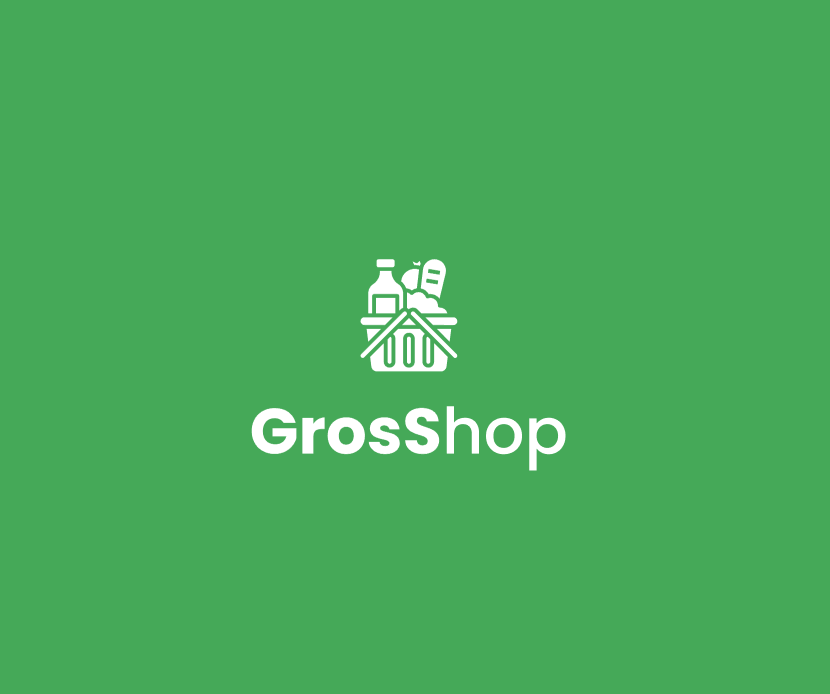
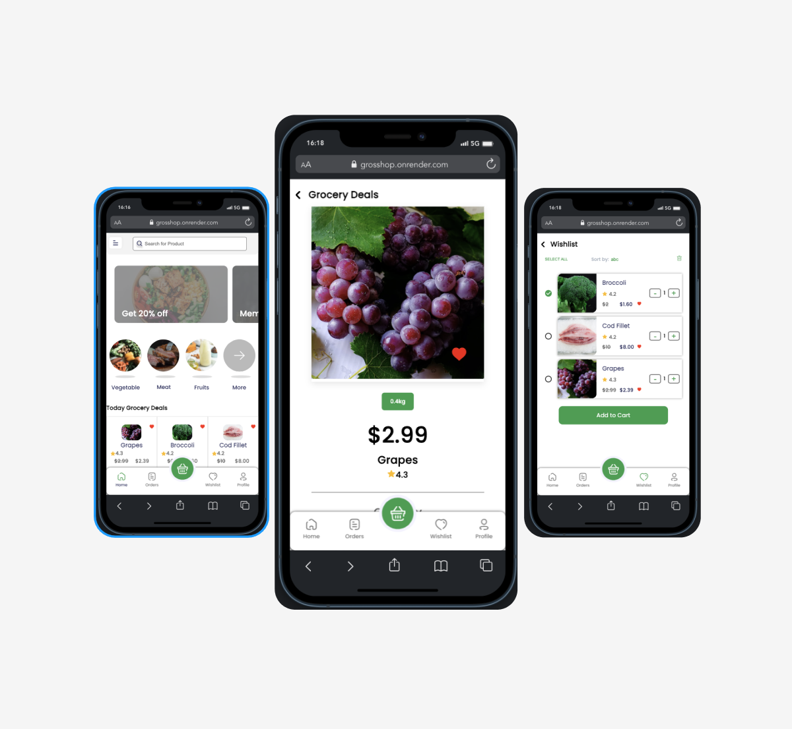
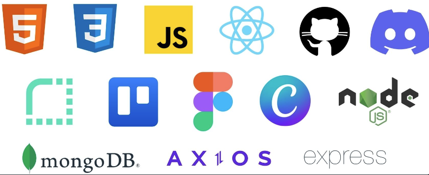

**Grocery Shop (GrosShop) App**

<div style="display: flex; justify-content: center;">
  
</div>
Welcome to the GrosShop Full Stack MERN (MongoDB, Express, React, Node.js) App repository! GrosShop is a practical app for ordering food. With it, you can conveniently and easily order groceries directly to your smartphone,
without having to leave the house. No more tedious lugging of heavy shopping bags - GrosShop makes shopping easier and more convenient. This README file will guide you through the installation, features, and technologies used in the app.

## Table of Contents 📑

- [Demo](#demo)
- [Features](#features)
- [Tech Stack](#tech-stack)
- [Getting Started](#getting-started)
- [Installation](#installation)
- [Usage](#usage)
- [API Integration](#api-integration)
- [Database](#database)
- [Authentication](#authentication)
- [Backend Routes](#backend-routes)
- [Design](#design)
- [Deployment](#deployment)
- [Third-Party Libraries & Tools](#third-party-libraries--tools)
- [Contributors](#contributors)

## Demo

You can view a live demo of the GrosShop app at https://grosshop.onrender.com/.

## Features

The GrosShop app has the following features:

- **User Registration**: Users can create accounts to personalize their profile.
- **Orders**: Users can view their order status.
- **Shopping-cart**: Users can add products to their shopping cart and adjust their quantity.
- **Filter**: Users can filter the products by several categories and prices.
- **Search**: Users can search for specific products.
- **Favorites**: Users can add products to their favourites and adjust their quantity.

<div style="display: flex; justify-content: center;">
  
</div>

## Tech Stack

The GrosShop app uses the following technologies:

- **Frontend**: React, HTML, CSS
- **Backend**: Node.js, Express
- **Database**: MongoDB
- **API Integration**: Self-created API
- **Design Tools**: Canva, Figma
- **Version Control**: Git
- **Deployment**: Render.com
- **Communication**: Discord
- **HTTP Client**: Axios
- **Project Management**: Trello

<div style="display: flex; justify-content: center;">
  
</div>

## Getting Started

To run GrosShop on your local machine, follow these steps:

## Installation

1. Clone this repository:

   ```bash
   git clone https://github.com/CreateYourReality/backend-grosshop.git
   ```

2. Navigate to the project directory:

   ```bash
   cd backend-grosshop
   ```

3. Install frontend and backend dependencies:

   ```bash
   npm install
   cd frontend
   npm install
   cd ../backend
   npm install
   ```

## Usage

1. Start the app:

   ```bash
   npm run dev
   ```

   The frontend server will run on http://localhost:3000 and the backend server will run on http://localhost:3001.

2. Open the app in your browser at http://localhost:3000.

3. Register a new account or log in with the following credentials:

   ```bash
   email:
    password:
   ```

4. Explore the app!

5. To stop the server, press `Ctrl + C`.

## Database

The GrosShop app uses MongoDB to store user data. The database is hosted on MongoDB Atlas. The app uses the `mongoose` library to connect to the database. The app uses the `dotenv` library to load environment variables from the `.env` file. The Images are stored on `cloudinary`.

## Authentication

The GrosShop app uses JWT authentication. The app generates a JWT token when a user registers or logs in. The token is stored in local storage and is used to authenticate the user for protected routes. The token is valid for 24 hours. The app uses the `jsonwebtoken` library to generate and verify tokens. The app utilizes the `multer` middleware to manage file uploads. The app uses the `bcrypt` library to hash passwords. The app uses the `axios` library to make HTTP requests.

## Design

The app's wireframes were designed using Figma

## Deployment

The app is deployed using Render.com. Continuous deployment is set up to automatically deploy the app when changes are pushed to the `main` branch. The app is deployed at https://grosshop.onrender.com/. On Render the app uses the following environment variables: `RESET_SECRET`, `MAILGUN_API_KEY`, `TOKEN_SECRET`, `DB`, `PORT`, `CLOUDINARY_CLOUDNAME`, `CLOUDINARY_API_KEY`, `CLOUDINARY_API_SECRET`, `RENDER_EXTERNAL_URL`, `APP_NAME`.

## Third-Party Libraries & Tools

The GrosShop app uses the following third-party libraries:

- `axios` - Promise based HTTP client for the browser and node.js
- `bcrypt` - A library to help you hash passwords
- `cors` - CORS is a node.js package for providing a Connect/Express middleware that can be used to enable CORS with various options.
- `dotenv` - Dotenv is a zero-dependency module that loads environment variables from a .env file into process.env.
- `express` - Fast, unopinionated, minimalist web framework for node.
- `jsonwebtoken` - An implementation of JSON Web Tokens.
- `mongoose` - Mongoose is a MongoDB object modeling tool designed to work in an asynchronous environment.
- `multer` - Middleware for handling file uploads in Node.js.
- `react-router-dom` - DOM bindings for React Router.
- `cloudinary` - Cloudinary is a cloud service that offers a solution to a web application's entire image management pipeline.

## Contributors

Special thanks to the following contributors for their hard work on this project:

- [Paul](https://github.com/Quaselz)
- [Timo](https://github.com/CreateYourReality)
- [Boris](https://github.com/BorisD2023)
